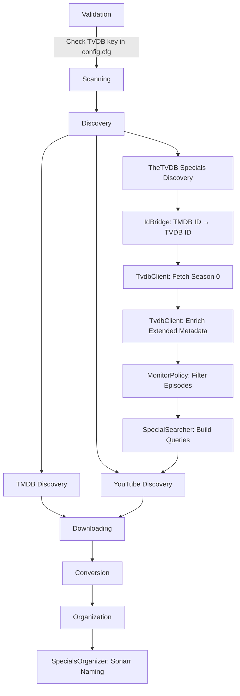

# Design Document: TV Series Specials via TheTVDB

## Overview

This feature adds TheTVDB API v4 as a data source for discovering and organizing TV Series Season 0 (Specials) content. The existing system uses TMDB for series metadata, but TheTVDB provides richer Season 0 episode data including airing order context, absolute numbering for anime, and movie-type specials.

The integration follows the existing pipeline architecture and plugs into the discovery phase. A new `TvdbClient` handles authentication and API communication. An `IdBridge` resolves TMDB IDs to TVDB IDs using TMDB's external_ids endpoint with a fuzzy-search fallback. A `MonitorPolicy` filters the often-massive Season 0 lists down to relevant episodes. A `SpecialSearcher` constructs targeted search queries for the YouTube discovery pipeline. The `SpecialsOrganizer` is extended to produce Sonarr-compatible filenames.

The TVDB API key is stored in the existing `config.cfg` file alongside the TMDB key, following the same prompt-and-save pattern.

## Architecture

The feature integrates into the existing pipeline at the discovery and organization phases:



Key architectural decisions:

1. **TvdbClient as a separate module** (`src/discovery/tvdb.rs`): Follows SRP — TVDB API communication is isolated from TMDB logic. Uses the existing `ContentDiscoverer`-style pattern but with its own trait since TVDB operates on series, not movies.

2. **IdBridge as a standalone component** (`src/discovery/id_bridge.rs`): Decouples ID resolution from both TMDB and TVDB clients. Caches resolved mappings with no expiration since TVDB IDs are stable.

3. **MonitorPolicy as a pure function module**: No state, no I/O — just takes episode metadata and series context, returns monitored/unmonitored decisions. Easy to test with property-based testing.

4. **Reuse existing infrastructure**: YouTube search via `YoutubeDiscoverer`, file downloading via `Downloader`, conversion via `Converter`, caching via `SeriesMetadataCache`.

## Components and Interfaces

### TvdbClient (`src/discovery/tvdb.rs`)

Handles all TheTVDB API v4 communication including authentication and token management.

```rust
pub struct TvdbClient {
    api_key: String,
    client: reqwest::Client,
    token: tokio::sync::RwLock<Option<String>>,
}

impl TvdbClient {
    pub fn new(api_key: String) -> Self;

    /// Authenticate and obtain a Bearer token
    async fn authenticate(&self) -> Result<String, DiscoveryError>;

    /// Ensure we have a valid token, re-authenticating if needed
    async fn ensure_token(&self) -> Result<String, DiscoveryError>;

    /// Execute an authenticated GET request with auto-retry on 401
    async fn authenticated_get(&self, url: &str) -> Result<reqwest::Response, DiscoveryError>;

    /// Fetch all Season 0 episodes with pagination
    pub async fn get_season_zero(&self, tvdb_id: u64) -> Result<Vec<TvdbEpisode>, DiscoveryError>;

    /// Fetch extended episode details
    pub async fn get_episode_extended(&self, episode_id: u64) -> Result<TvdbEpisodeExtended, DiscoveryError>;
}
```

### IdBridge (`src/discovery/id_bridge.rs`)

Resolves TMDB series IDs to TheTVDB IDs.

```rust
pub struct IdBridge {
    tmdb_api_key: String,
    tvdb_client: Arc<TvdbClient>,
    client: reqwest::Client,
    cache: IdMappingCache,
}

impl IdBridge {
    pub fn new(tmdb_api_key: String, tvdb_client: Arc<TvdbClient>, cache_dir: PathBuf) -> Self;

    /// Resolve a TMDB series ID to a TVDB ID
    pub async fn resolve(&self, tmdb_id: u64, series_title: &str) -> Result<Option<u64>, DiscoveryError>;

    /// Query TMDB external_ids endpoint
    async fn query_tmdb_external_ids(&self, tmdb_id: u64) -> Result<Option<u64>, DiscoveryError>;

    /// Fallback: search TVDB and fuzzy match
    async fn search_tvdb_fallback(&self, series_title: &str) -> Result<Option<u64>, DiscoveryError>;
}
```

### MonitorPolicy (`src/discovery/monitor_policy.rs`)

Determines which Season 0 episodes should be actively searched for.

```rust
pub struct MonitorPolicy;

impl MonitorPolicy {
    /// Filter episodes to only those that should be monitored
    pub fn filter_monitored(
        episodes: &[TvdbEpisodeExtended],
        latest_season: u8,
        manual_monitor_list: &[u8],
    ) -> Vec<&TvdbEpisodeExtended>;

    /// Check if a single episode should be monitored
    pub fn should_monitor(
        episode: &TvdbEpisodeExtended,
        latest_season: u8,
        manual_monitor_list: &[u8],
    ) -> bool;
}
```

### SpecialSearcher (`src/discovery/special_searcher.rs`)

Constructs search queries for special episodes.

```rust
pub struct SpecialSearcher;

impl SpecialSearcher {
    /// Build search queries for a monitored special episode
    pub fn build_queries(
        series_title: &str,
        episode: &TvdbEpisodeExtended,
    ) -> Vec<String>;
}
```

### IdMappingCache (`src/discovery/id_bridge.rs`)

Persistent cache for TMDB→TVDB ID mappings with no expiration.

```rust
struct IdMappingCache {
    cache_dir: PathBuf,
}

impl IdMappingCache {
    fn new(cache_dir: PathBuf) -> Self;
    async fn get(&self, tmdb_id: u64) -> Option<u64>;
    async fn set(&self, tmdb_id: u64, tvdb_id: u64) -> Result<(), DiscoveryError>;
}
```

### Config Extension (`src/config.rs`)

The existing `Config` struct is extended with an optional TVDB API key.

```rust
pub struct Config {
    pub tmdb_api_key: String,
    #[serde(default)]
    pub tvdb_api_key: Option<String>,
}
```

### Error Types (`src/error.rs`)

New error variants for TVDB operations:

```rust
pub enum DiscoveryError {
    // ... existing variants ...
    #[error("TVDB authentication failed: {0}")]
    TvdbAuthError(String),
    #[error("TVDB API error: {0}")]
    TvdbApiError(String),
}
```

## Data Models

### TvdbEpisode

Base episode data from the Season 0 listing endpoint.

```rust
#[derive(Debug, Clone, Serialize, Deserialize)]
pub struct TvdbEpisode {
    pub id: u64,
    pub number: u8,
    pub name: String,
    #[serde(default)]
    pub aired: Option<String>,
    #[serde(default)]
    pub overview: Option<String>,
}
```

### TvdbEpisodeExtended

Enriched episode data from the extended endpoint.

```rust
#[derive(Debug, Clone, Serialize, Deserialize)]
pub struct TvdbEpisodeExtended {
    pub id: u64,
    pub number: u8,
    pub name: String,
    #[serde(default)]
    pub aired: Option<String>,
    #[serde(default)]
    pub overview: Option<String>,
    #[serde(default)]
    pub absolute_number: Option<u32>,
    #[serde(default)]
    pub airs_before_season: Option<u8>,
    #[serde(default)]
    pub airs_after_season: Option<u8>,
    #[serde(default)]
    pub airs_before_episode: Option<u8>,
    #[serde(default)]
    pub is_movie: Option<bool>,
}
```

### TvdbSearchResult

Search result from the TVDB `/search` endpoint.

```rust
#[derive(Debug, Clone, Deserialize)]
pub struct TvdbSearchResult {
    pub tvdb_id: String,
    pub name: String,
    #[serde(default)]
    pub year: Option<String>,
}
```

### ManualMonitorConfig

User-provided configuration file for manually monitoring specific specials.

```rust
#[derive(Debug, Clone, Serialize, Deserialize)]
pub struct ManualMonitorConfig {
    pub monitored_episodes: Vec<u8>,
}
```

This file lives at `{series_folder}/specials_monitor.json`.

### API Response Wrappers

```rust
#[derive(Debug, Deserialize)]
struct TvdbApiResponse<T> {
    status: String,
    data: T,
}

#[derive(Debug, Deserialize)]
struct TvdbEpisodesPage {
    episodes: Vec<TvdbEpisode>,
    #[serde(default)]
    next: Option<String>,
}

#[derive(Debug, Deserialize)]
struct TvdbLoginResponse {
    token: String,
}

#[derive(Debug, Deserialize)]
struct TvdbSearchResponse {
    data: Vec<TvdbSearchResult>,
}
```

### Existing Model Extensions

The existing `SpecialEpisode` struct in `models.rs` gains an optional `tvdb_id` field:

```rust
pub struct SpecialEpisode {
    pub episode_number: u8,
    pub title: String,
    pub air_date: Option<String>,
    pub url: Option<String>,
    pub local_path: Option<PathBuf>,
    pub tvdb_id: Option<u64>,  // NEW: TheTVDB episode ID
}
```

The existing `SourceType` enum gains a TVDB variant:

```rust
pub enum SourceType {
    TMDB,
    ArchiveOrg,
    YouTube,
    TheTVDB,  // NEW
}
```


## Correctness Properties

*A property is a characteristic or behavior that should hold true across all valid executions of a system — essentially, a formal statement about what the system should do. Properties serve as the bridge between human-readable specifications and machine-verifiable correctness guarantees.*

### Property 1: Config Serialization Round-Trip

*For any* Config containing arbitrary `tmdb_api_key` and `tvdb_api_key` values, serializing to JSON and deserializing back SHALL produce an equivalent Config with both fields preserved.

**Validates: Requirements 1.6**

### Property 2: TVDB API URL Construction

*For any* valid TVDB series ID and episode ID, the TvdbClient SHALL construct URLs matching the patterns `https://api4.thetvdb.com/v4/series/{id}/episodes/default?season=0&page={n}` and `https://api4.thetvdb.com/v4/episodes/{id}/extended` respectively.

**Validates: Requirements 3.1, 4.1**

### Property 3: TVDB Episode Parsing Completeness

*For any* valid TVDB episode JSON containing id, number, name, aired, and overview fields, parsing into `TvdbEpisode` SHALL populate all corresponding struct fields. *For any* valid extended episode JSON additionally containing absolute_number, airs_before_season, airs_after_season, airs_before_episode, and is_movie, parsing into `TvdbEpisodeExtended` SHALL populate all corresponding struct fields.

**Validates: Requirements 3.3, 4.2**

### Property 4: Monitor Policy Correctness

*For any* set of Season 0 episodes, a latest season number, and a manual monitor list, an episode SHALL be monitored if and only if: (a) its `airs_after_season` equals the latest season number, OR (b) its `is_movie` flag is true, OR (c) its episode number appears in the manual monitor list. All other episodes SHALL be unmonitored.

**Validates: Requirements 5.1, 5.2, 5.3, 5.4**

### Property 5: Only Monitored Episodes Produce Search Queries

*For any* set of Season 0 episodes partitioned into monitored and unmonitored by MonitorPolicy, the SpecialSearcher SHALL produce queries only for episodes in the monitored set, and the count of episodes with queries SHALL equal the count of monitored episodes.

**Validates: Requirements 5.5**

### Property 6: Search Query Construction Correctness

*For any* monitored special episode with a series title, the generated query list SHALL: (a) always contain a query matching `{title} S00E{number:02} {episode_title}`, (b) always contain a fallback query matching `{title} {episode_title}`, (c) contain a query with "movie" appended if `is_movie` is true, and (d) contain a query with `OVA {absolute_number}` if `absolute_number` is present.

**Validates: Requirements 6.1, 6.2, 6.3, 6.4**

### Property 7: Sonarr-Compatible File Path Construction

*For any* series title, specials folder name, episode number, and episode title, the SpecialsOrganizer SHALL produce a file path matching `{series_folder}/{specials_folder_name}/{series_title} - S00E{number:02} - {sanitized_title}.mkv` where the episode number is the TVDB `aired_episode_number`.

**Validates: Requirements 7.1, 7.2, 7.3**

### Property 8: Filename Sanitization Removes Windows-Invalid Characters

*For any* string, the sanitized output SHALL contain none of the characters `\ / : * ? " < > |`. The sanitized output SHALL have length less than or equal to the original string length.

**Validates: Requirements 7.4**

### Property 9: ID Mapping Cache Has No Expiration

*For any* stored TMDB-to-TVDB ID mapping, the cached value SHALL be retrievable regardless of the age of the cache entry. The ID mapping cache SHALL not apply TTL-based expiration.

**Validates: Requirements 9.4**

### Property 10: Fuzzy Match ID Resolution Selects Highest Score Above Threshold

*For any* set of TVDB search results and a query title, the IdBridge SHALL select the result with the highest fuzzy match similarity score, and that score SHALL be at least 80%. If no result meets the 80% threshold, the IdBridge SHALL return None.

**Validates: Requirements 2.3**

## Error Handling

### Error Types

New error variants are added to the existing `DiscoveryError` enum:

- `TvdbAuthError(String)` — Authentication failures (invalid key, login endpoint errors)
- `TvdbApiError(String)` — General TVDB API errors (non-2xx responses, parsing failures)

### Error Strategies

| Scenario | Strategy | Requirement |
|---|---|---|
| TVDB authentication failure | Return error, skip all TVDB operations for this run | 1.3 |
| HTTP 401 during API call | Re-authenticate once, retry; fail if second attempt fails | 1.4 |
| Network timeout | Retry once after 2s delay; report failure if retry fails | 10.4 |
| TMDB external_ids returns no tvdb_id | Fall back to TVDB search; if no match, log warning and skip series | 2.3, 2.4 |
| Season 0 fetch returns empty/error | Return empty list, log condition, continue processing | 3.4 |
| Extended episode enrichment fails | Retain base metadata, log warning, continue | 4.3 |
| Duplicate target file exists | Skip file, log message, continue | 7.5 |
| Config file missing tvdb_api_key | Prompt user, save to config.cfg | 1.1, 8.1 |

### Error Isolation

Errors in TVDB operations for one series SHALL NOT affect processing of other series. This follows the existing error isolation pattern in the orchestrator where each series is processed independently.

### Uncategorized / Low-Confidence Downloads

When a downloaded video cannot be confidently matched to a specific special episode (e.g., the YouTube result title doesn't clearly correspond to the TVDB episode), the system handles it as follows:

- The SpecialSearcher constructs targeted queries using TVDB episode numbers and titles, so results are already scoped to specific episodes.
- If a YouTube search returns results but the video title has low fuzzy match similarity (below 60%) to the expected episode title, the download is skipped and logged at warning level.
- Successfully downloaded files that pass the title similarity check are organized normally using the TVDB episode number from the query that produced them.
- This avoids polluting the specials folder with mismatched content. The threshold is intentionally lower than the 80% ID resolution threshold since video titles on YouTube often include extra text (channel names, "FULL EPISODE", etc.).

## Testing Strategy

### Property-Based Testing

Property-based tests use `proptest` (1.5) with a minimum of 100 iterations per property. Each test references its design document property.

| Property | Test Target | Generator Strategy |
|---|---|---|
| P1: Config round-trip | `Config` serialization | Random API key strings |
| P2: URL construction | `TvdbClient` URL builders | Random u64 IDs and page numbers |
| P3: Episode parsing | `TvdbEpisode` / `TvdbEpisodeExtended` deserialization | Random JSON with required fields |
| P4: Monitor policy | `MonitorPolicy::should_monitor` | Random episodes with varied airs_after_season, is_movie, manual lists |
| P5: Monitored-only queries | `MonitorPolicy` + `SpecialSearcher` integration | Random episode sets with mixed monitor status |
| P6: Query construction | `SpecialSearcher::build_queries` | Random titles, episode numbers, is_movie flags, absolute_numbers |
| P7: File path construction | `SpecialsOrganizer` path building | Random series titles, folder names, episode numbers, titles |
| P8: Filename sanitization | Sanitization function | Random strings including Windows-invalid characters |
| P9: ID cache no expiration | `IdMappingCache` | Random IDs with varied timestamps |
| P10: Fuzzy match selection | `IdBridge` fuzzy matching logic | Random search result sets with varied similarity scores |

### Unit Testing

Unit tests cover specific examples, edge cases, and error conditions:

- Authentication flow: valid key, invalid key, expired token retry
- Pagination: single page, multi-page, empty response
- ID resolution: TMDB hit, TVDB fallback hit, no match
- Monitor policy: no conditions met, airs_after_season match, is_movie, manual list, combinations
- Search queries: standard episode, movie special, anime with absolute number
- File organization: normal case, duplicate file skip, cross-drive move
- Config: existing config with tvdb_key, existing config without tvdb_key, new config
- Validation: specials enabled with key, specials enabled without key, specials disabled

### Integration Testing

Integration tests verify the end-to-end flow using filesystem operations and mock HTTP responses:

- Full specials discovery pipeline for a mock series
- Cache hit/miss scenarios with real filesystem
- Config load/save with tvdb_api_key field
